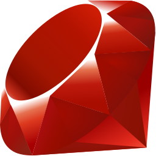
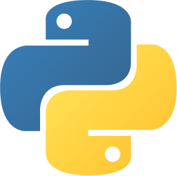
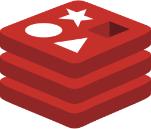

# Overview

埼玉県在住の24歳。
のんびり生きています。

# Social

# Skill

## Language

## Framework/Library

## RDB/NoSQL

## Cloud

## CI/CD

## Other

# Works

## [Koki Sato](https://koki.me)

個人用ポートフォリオサイト。

[View on GitHub](https://github.com/koki-develop/koki-develop)

## [LGTM Generator](https://lgtmgen.org)

シンプルな LGTM 画像生成サービス。

[View on GitHub](https://github.com/koki-develop/lgtm-generator)

## [Awesome Notes](https://chrome.google.com/webstore/detail/awesome-notes/oahbimjdpmgidnloajppdlhlpkepmipo)

マークダウンショートカット機能つきのシンプルなメモを提供する Chrome Extension 。

[View on GitHub](https://github.com/koki-develop/awesome-notes)

## [Qiita LGTM Ranking](https://qiita.com/items/b6cfc81906990b3a3e72)

Qiita の LGTM ランキング記事を毎日自動更新するシステム。

[View on GitHub](https://github.com/koki-develop/qiita-lgtm-ranking)

## [Hyper Statusbar](https://github.com/koki-develop/hyper-statusbar)

ステータスバーを表示する Hyper プラグイン。

[View on GitHub](https://github.com/koki-develop/hyper-statusbar)

## [CheckIP](https://checkip.dev)

クライアントの IP アドレスを返すシンプルな API 。

[View on GitHub](https://github.com/koki-develop/checkip)

# Contact

[kou.pg.0131@gmail.com](mailto:kou.pg.0131@gmail.com)
